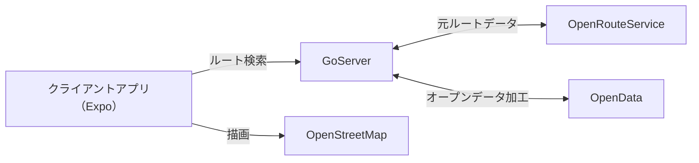
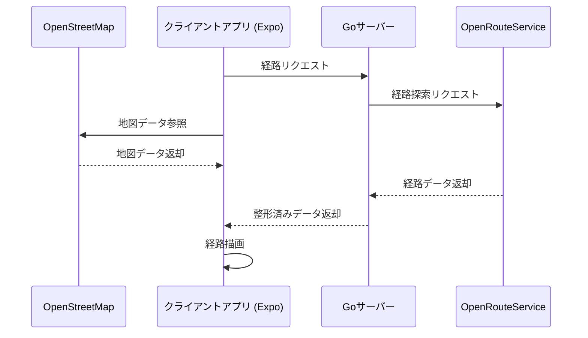

# CHARIMACHI


<p style="text-align: center;">
  
  
</p>

## デモ


[動画](https://drive.google.com/file/d/1YiH47TsoH7ZssMZgoyyxL8HFdFj577jk/view?usp=sharing)

## 概要

安全、快適な車道通行ルートを提案する 自転車専用ナビアプリ CHARIMACHI

自転車利用者が安心して車道を走行できるよう支援するナビゲーションアプリを開発しました。自転車での移動を安全かつ快適に走行できるルートを検索・提示し、通行に適した道を優先的に案内します。さらに、交通安全に関する注意喚起として、事故が多発している場所や違反率が高い場所へのピン止めなどをすることで、事故や違反が身近にあるという認識を高め、車道通行の重要性理解を促進します。
注意喚起をするだけのサービスでは、重要性を理解されていない方々への普及は難しいと考え、日常的につかうナビゲーションアプリとすることで、安全な走行環境を提供しつつ、自転車の車道通行を社会に定着させることを目指します。

## なぜこのサービスを作るのか

車道通行が根付かない要因として、事故や違反が身近にあるという認識が薄く、注意喚起を目にする機会も少ないため、その重要性を十分に理解していないこと、さらに安全に通行できない車道が存在し、安全・快適に自転車を走行できるルートが確認できないことにあると考えました。本サービスではこの二点の課題解決を目指します。

### 安全かつ快適とはどのような道か

- 自転車専用帯が確保されている
- 歩道内に自転車帯が確保されている
- 車道の幅が広い
- 信号待ちの回数が少ない
- 路駐・路停車が少ない
- 大型車両の通行量が多くない

(最後2項目は今回実装できないかもしれない要件)

## 機能

- マップ表示
- 現在地表示
- 出発地・到着地の候補検索
- ルート描画
  - 自転車専用帯優先
  - 信号まち回避
  - 混雑車道回避
  - 注意喚起
    - 取締強化交差点注意(オープンデータ)
    - 事故が多い地点(今回実装を見送る可能性あり)
- 経由地点表示
- 所要時間表示
- about画面・制作元・出典
- (駐輪所経由モード)
- (バス停回避モード)

## 使うデータ

### 自転車専用帯優先

- [OpenRouteService](https://openrouteservice.org)

### 取締強化交差点注意（オープンデータ）

- [東京都オープンデータカタログ - 交通規制情報](https://catalog.data.metro.tokyo.lg.jp/dataset/t000022d1700000024/resource/fb207998-df4c-434c-9280-1d7c2fbfdf1d)

### 違反率別注意交差点(オープンデータ)

- [交通量統計表](https://catalog.data.metro.tokyo.lg.jp/dataset/t000022d0000000035)

    事前にファイル読み込み

    - [（偶数年調査）主要交差点（区部）](https://catalog.data.metro.tokyo.lg.jp/dataset/t000022d0000000035/resource/b315688c-ac19-4b0d-b4be-de6414af7666)

    - [（偶数年調査）主要交差点（多摩部）](https://catalog.data.metro.tokyo.lg.jp/dataset/t000022d0000000035/resource/ddaaa1ac-0d4a-4406-9e7c-f6d66aa74c55)

- [Overpass API](https://overpass-api.de/api/interpreter)

    交通量統計表の交差点ポイントを座標化


### 信号まち回避

- [OpenStreetMap](https://www.openstreetmap.org/) ?

### 混雑車道回避

- [警視庁 - 交差点区部統計データ](https://www.keishicho.metro.tokyo.lg.jp/about_mpd/jokyo_tokei/tokei_jokyo/ryo.files/02_kousatenkubu_csv.zip) ?
- [国土交通省 - 道路統計データ](https://www.mlit.go.jp/road/ir/ir-data/ir-data.html) ?

### （駐輪所経由モード）

- [東京都オープンデータカタログ - 駐輪場情報](https://catalog.data.metro.tokyo.lg.jp/dataset?q=title%3A+%E9%A7%90%E8%BC%AA%E5%A0%B4&sort=score+desc%2C+metadata_modified+desc) ?

### （バス停回避モード）

- [公共交通オープンデータ - 都営バス停留所データ](https://ckan.odpt.org/dataset/b_busstop-toei/resource/f340278d-aefe-47ea-bc8f-15ebe48c286d)
    
    必要情報のみ抜き出し加工
    CC BY 4.0(クレジット明示必要)

## 構成図

### アーキテクチャ



### 処理の流れ



---

### [mobile-app](./mobile-app)

This is a template for mobile app development using:

- [Expo](https://expo.dev/)
- [React Native](https://reactnative.dev/)
- [Node.js](https://nodejs.org/) v22.14.0

### [api](./api)

This is a template for building APIs using:

- [Go](https://go.dev/) with [Gin](https://gin-gonic.com/) framework
- [gin-swagger](https://github.com/swaggo/gin-swagger) for OpenAPI/Swagger generation

### [openapi-specifications](./openapi-specifications)

This directory contains OpenAPI specifications swagger files.
OpenAPI version 3.0 is used for the specifications, and the files are in JSON format.

To generate the OpenAPI definitions, run the following command from the repository root:

```bash
./generate-openapi.sh
```

This script will:

1. Generate Swagger 2.0 documentation using `swag init` in the API directory
2. Convert the Swagger 2.0 specification to OpenAPI 3.0.0 format
3. Place the result in `openapi-specifications/api.swagger.json`
4. Verify that React Native type generation and mock server commands work correctly

- [OpenAPI](https://www.openapis.org/)
- [Swagger](https://swagger.io/)

### [ls-lint](./.ls-lint.yml)

This is a configuration file for [ls-lint](https://ls-lint.org/), a linter for directory structures.  
GitHub Actions are set up to run ls-lint on pull requests to ensure that the directory structure adheres to the defined rules.  
For [api](./api) and [mobile-app](./mobile-app) directories, add settings for each directory, as they are ignored except for markdown files.

## Clone

```
git clone --recurse-submodules https://github.com/rowicy/charimachi.git
```
